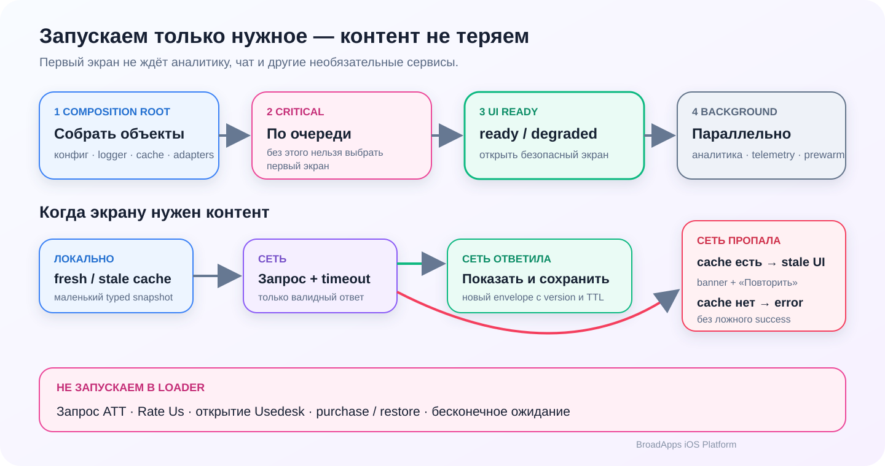
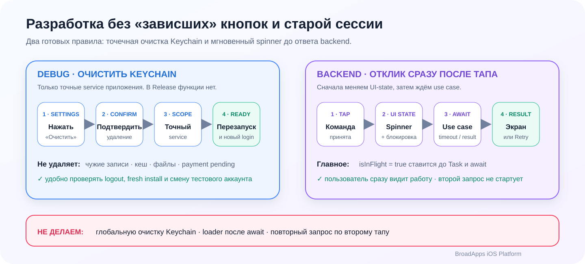

# BroadCore

<p align="center">
  <picture>
    <source media="(prefers-color-scheme: dark)" srcset="Documentation/Assets/README/hero-dark.svg">
    <source media="(prefers-color-scheme: light)" srcset="Documentation/Assets/README/hero-light.svg">
    
  </picture>
</p>

<p align="center">
  
  
  
  
</p>

Foundation‑модуль BroadApps для bootstrap, cache, typed states/errors, logging,
retry/timeout, networking classification, persistence boundary и ATT adapter.

[Документация BroadApps iOS](https://broadapps-ios-docs.nkhsnv.chatgpt.site) ·
[Создание приложения](https://broadapps-ios-docs.nkhsnv.chatgpt.site/docs/app-creation) ·
[Changelog](CHANGELOG.md) ·
[Публичный API](Documentation/PublicAPI.md) ·
[Как предложить правку](CONTRIBUTING.md)

**Быстрый маршрут:** [установка](#installation) · [bootstrap](#minimal-bootstrap) ·
[cache](#cache-contract) · [runtime-карта](#runtime-карта) ·
[ATT](#att-boundary) · [проверка](#проверка)

## Что делает модуль

- выполняет critical/background bootstrap с конечными timeout и bounded retry;
- хранит provider-neutral versioned cache и отличает fresh/stale/missing;
- даёт `LoadableState`, typed `AppError` и безопасную network classification;
- пишет typed privacy-safe events через `BroadLoggerProtocol`;
- изолирует `UserDefaults` и ATT в infrastructure adapters;
- регистрирует foundation dependencies через `BroadCoreAssembly`.

## Runtime-карта

<picture>
  <source media="(prefers-color-scheme: dark)" srcset="Documentation/Assets/README/startup-cache-dark.svg">
  <source media="(prefers-color-scheme: light)" srcset="Documentation/Assets/README/startup-cache-light.svg">
  
</picture>

Core отвечает за **механику**, а не за продуктовые решения приложения:

| Сценарий | Контракт BroadCore | Решение host app |
|---|---|---|
| Первый запуск | bounded critical steps, затем background work | какие сервисы действительно critical |
| Контент | `fresh`, `stale` или `missing(reason)` | можно ли показывать stale для этого экрана |
| Ошибка сети | typed classification и retryability | текст, экран и момент Retry |
| Логи | typed allow-list без raw payload | subsystem и destinations |
| ATT | system adapter и use case | вызвать только после видимого первого onboarding-слайда |

Нельзя помещать в bootstrap ATT, Rate Us, Usedesk, purchase/restore, RU checkout
или бесконечное ожидание внешнего SDK. Background failure может дать
`degraded`, но не должен навсегда удерживать первый экран.

## Мгновенный отклик async-действий

<picture>
  <source media="(prefers-color-scheme: dark)" srcset="Documentation/Assets/README/debug-feedback-dark.svg">
  <source media="(prefers-color-scheme: light)" srcset="Documentation/Assets/README/debug-feedback-light.svg">
  
</picture>

Кнопка, запускающая backend или SDK use case, синхронно устанавливает
`isInFlight` **до** создания `Task` и первого `await`. Повторный tap блокируется,
а timeout/offline завершаются typed-состоянием, а не ложным success.

UI этого loader остаётся app-owned или принадлежит `BroadUIFlows`; Core даёт
состояния, timeout/retry и безопасную классификацию ошибки.

## Что модуль принципиально не делает

- не содержит paywall, purchase, entitlement, RU Billing или готовый SwiftUI flow;
- не зависит от других BroadApps-модулей;
- не принимает app-owned product decisions;
- не логирует raw URL/error/receipt/token/user data;
- не запрашивает ATT из bootstrap, loader или `init`.

## Product и dependencies

| Product | Platform | BroadApps dependencies | External dependencies |
|---|---|---|---|
| `BroadCore` | iOS 17+, iPhone | нет | Swinject `2.10.0` |

Host app подключает этот repository только по надобности и импортирует
Core напрямую, когда использует его API. Обязательного
umbrella package нет.

## Installation

```swift
dependencies: [
    .package(
        url: "https://github.com/BroadApps-official/broad-core-ios.git",
        from: "1.1.0"
    )
]
```

Добавьте product `BroadCore` нужному iPhone target:

```swift
import BroadCore
```

## Minimal bootstrap

```swift
let loggingSubsystem = Bundle.main.bundleIdentifier ?? "com.example.app"

let bootstrap = AppBootstrapCoordinator(
    steps: [
        BootstrapStep(
            id: .init(rawValue: "configuration"),
            name: "Load configuration",
            criticality: .critical,
            timeoutPolicy: .seconds(3),
            retryPolicy: .fixed(retryCount: 1, delay: 0.2)
        ) {
            .completed
        }
    ],
    logger: OSLogBroadLogger(subsystem: loggingSubsystem)
)

let state = await bootstrap()
```

Critical failure выбирает безопасный failed route. Background failure может
сделать итог degraded, но не зависает бесконечно.

`OSLogBroadLogger` принимает и строковый literal, и runtime `String`, поэтому
bundle ID не нужно дублировать в composition root.

## Cache contract

`VersionedJSONCacheRepository` проверяет schema, version, TTL и corruption
отдельно. Policy явно задаёт, удалить или сохранить неподходящую запись.

Маленькие flags/state можно хранить в `UserDefaultsKeyValueStore`. Для большого
offline-каталога используйте готовый file-backed store, а не увеличивайте лимит
`UserDefaults`:

```swift
let cacheDirectory = FileManager.default.urls(
    for: .cachesDirectory,
    in: .userDomainMask
).first!.appendingPathComponent("BroadAppsCatalog", isDirectory: true)

let store = FileSystemKeyValueStore(
    directoryURL: cacheDirectory,
    namespace: Bundle.main.bundleIdentifier ?? "com.example.app",
    maximumDataSize: 4 * 1024 * 1024
)
```

`FileSystemKeyValueStore` создаёт каталог при первой записи, пишет атомарно,
хеширует namespace+key в безопасное имя файла и поддерживает тот же
compare-and-swap contract, что и `UserDefaultsKeyValueStore`.

```swift
let policy = CachePolicy(
    timeToLive: 3_600,
    corruptedEntryAction: .remove,
    schemaMismatchAction: .preserve,
    versionMismatchAction: .remove
)
```

## ATT boundary

Core предоставляет adapter/use case, но момент запроса выбирает host/UI flow.
Разрешённый contract: запрос после фактического появления первого onboarding
слайда. Bootstrap и loader ATT не вызывают.

## Public entry points

- `AppBootstrapCoordinator`, `BootstrapStep`, `BootstrapErrorMessages`;
- `RetryPolicy`, `TimeoutPolicy`;
- `CachePolicy`, `CacheEnvelope`, `CacheReadResult`, cache repositories;
- `UserDefaultsKeyValueStore` для небольшого state и
  `FileSystemKeyValueStore` для больших cache payload;
- `LoadableState`, `AppError`, `NetworkFailureClassifier`;
- `BroadLoggerProtocol`, typed `BroadLogEvent`, OSLog/no-op adapters;
- `TrackingAuthorizationUseCaseProtocol` и system adapter;
- `BroadCoreAssembly`.

Полный symbol report: [Public API](Documentation/PublicAPI.md).

## Contract probe

```bash
bash Scripts/run_contract_probes.sh
```

Probe компилирует настоящие production types и проверяет retry, timeout, cache,
safe network classification и file-backed read/write/CAS без XCTest/Swift
Testing.

## Sandbox

```bash
bash Scripts/generate_sandbox.sh
open Examples/BroadCoreSandbox/BroadCoreSandbox.xcodeproj
```

Sandbox показывает bootstrap state transitions, cache policy, retry/timeout,
typed error и logging на iPhone. Это technical example, не product design.

## Проверка

```bash
bash Scripts/module_gate.sh
```

Gate проверяет boundaries, secrets, privacy manifest, format/lint, package,
executable probe, Debug/Release sandbox, bundled privacy manifest, DocC, links и
public API report. Test targets не создаются.

## Versioning

Модуль выпускается независимо по SemVer. Consumers используют совместимый
major range; integration catalog фиксирует exact known-good tag. Cross-repo
изменение начинается с additive Core API, затем выпускает Core и обновляет
consumers снизу вверх.

## Documentation

- [Module guide](Documentation/BroadCore.md);
- [DocC landing](Sources/BroadCore/BroadCore.docc/BroadCore.md);
- [Public searchable docs](https://broadapps-ios-docs.nkhsnv.chatgpt.site).

Документы публичны и принимают правки через pull request / `Edit this page`.

## Contribution

Обновите behavior, probe/sandbox, DocC/README, public API report и changelog,
запустите `bash Scripts/module_gate.sh`, затем откройте PR с объяснением, что
изменилось и почему.
